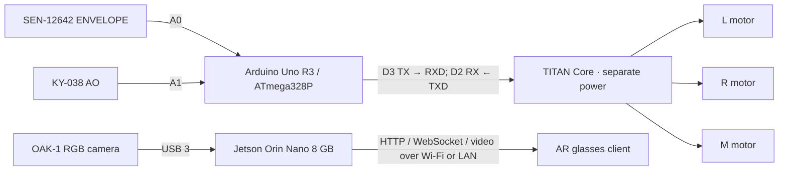

# Current hardware architecture

The agreed setup has two independently powered and operated subsystems. This document records
the intended architecture; the implementation gaps below distinguish it from the existing code.

## Sound and haptics

| Connection | Destination |
|---|---|
| SEN-12642 VCC / GND | Arduino 5V / GND |
| SEN-12642 ENVELOPE | Arduino A0 |
| SEN-12642 AUDIO / GATE | Unconnected |
| KY-038 + / G or GND | Arduino 5V / GND |
| KY-038 AO | Arduino A1 |
| KY-038 DO | Unconnected |
| Arduino D3, SoftwareSerial TX | TITAN RXD |
| Arduino D2, SoftwareSerial RX | TITAN TXD |
| Arduino GND | TITAN GND |

Reserve the Uno hardware UART for its USB interface. Per the supplied hardware specification,
TITAN supports 3.3 V / 5 V I/O, so this Uno-to-TITAN connection does not use the old Pi resistor
divider. Power TITAN through its supported USB/battery path, rather than the Arduino 5 V rail.
Power the Arduino independently of the Jetson to preserve operation when the Jetson is offline.

Connect three independent motors to L+/L−, R+/R−, and M+/M−. An independently controlled fourth
motor needs a second TITAN or another motor driver.

The Arduino samples A0 and A1, calibrates and normalizes each sensor separately, then maps
sound amplitude to haptic intensity: louder sound produces stronger vibration. SEN envelope
and KY waveform readings need different amplitude extraction; raw ADC values are not directly
comparable. Directional inference is not required for this amplitude-based behavior.

## Vision and AR

Connect OAK-1 directly to a Jetson USB 3 Type-A port. The camera supplies RGB video; the Jetson
is intended to detect and track people, associate caption text with them, and render or describe
person labels and speech-bubble overlays. Its network server exposes the interface at
`http://<JETSON_IP>:<PORT>` for the AR client on the same Wi-Fi/LAN.

There is no required electrical or data connection between this subsystem and the Arduino.
Sound-direction fusion can be added later. The analog sound sensors are amplitude inputs,
not a transcription audio source; speech recognition still needs a microphone/audio path.
The existing browser microphone flow requires HTTPS or localhost.

## Implementation status

- `firmware/sound_sensors/sound_sensors.ino` currently emits raw amplitude features over USB
  serial. It still needs onboard calibration/normalization and direct SoftwareSerial TITAN commands.
- `jetson/hardware_bridge.py` implements the previous host-mediated calibration and motor control.
  It is not part of this new standalone haptic path.
- The current Jetson launch scripts can start that legacy bridge. Use `--no-haptics` when running
  `scripts/jetson_start.sh` for the independent architecture.
- OAK-1 RGB capture through a DepthAI `FrameSource` is not implemented. The existing OAK backend
  is a skeleton, and the USB webcam source is not an OAK-1 integration.
- The current host tracks faces and serves video and face metadata. Transcription, caption
  association, and overlay drawing currently run through the browser/cloud flow. Moving caption
  association or rendering onto the Jetson requires further implementation.

The older [Jetson runbook](JETSON_SETUP.md) documents the implemented CSI/UVC and USB-serial
bridge build; its wiring is superseded by this architecture for the new hardware setup.
