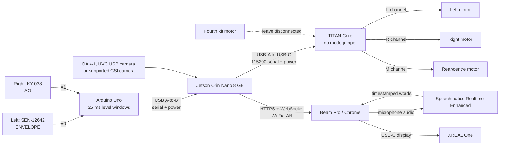

# Jetson Orin Nano 8 GB build

This is a parallel build. The Raspberry Pi code and scripts remain available; the Jetson reuses the
same face tracking, caption server, browser page, Beam Pro, and XREAL flow. Only the host/camera path
and the sound-sensor/haptic transport differ.

## What this build assumes

- NVIDIA Jetson Orin Nano 8 GB developer kit on the NVIDIA P3768 reference carrier board.
- JetPack with Python 3.10-3.12. JetPack 6.2.1 is the conservative dependency target; the installer
  also accepts a current JetPack whose Python remains in that range.
- Camera: an OAK-1 over USB 3, a UVC USB webcam, or a Jetson-supported CSI camera. NVIDIA documents
  Raspberry Pi Camera Module 2 / IMX219 with a 15-pin-to-22-pin cable. A Camera Module 3 / IMX708 is not
  a drop-in replacement unless the camera vendor supplies a matching Jetson driver/device tree.
- The existing SEN-12642, KY-038, Arduino Uno, TITAN Core/THCR-004, Beam Pro, XREAL One, and motors.
- Three connected motors. The TITAN Core exposes three independent outputs even though the kit ships
  with four motors; the fourth stays disconnected.

The two analog microphone boards are only coarse loudness sensors. They do not replace the Beam Pro
microphone used for transcription and cannot do time-of-arrival localisation or beamforming.
The ADS1115 shown in the older sketch is not part of this build: the retained Arduino already provides
both required ADC inputs, and USB serial moves those readings to the Jetson safely.

## Master diagram



There are two deliberately separate Jetson processes. `pi/main.py` owns vision, captions, and the web
server. `jetson/hardware_bridge.py` owns the Arduino-to-TITAN path. A loose sensor cable therefore does
not take captions down.

## Wiring

Disconnect the Jetson barrel supply, Arduino USB cable, TITAN power, and camera before wiring. Never
put 5 V on a Jetson signal pin; every J12 signal is 3.3 V.

### 1. Power and camera

1. Power the Jetson through its DC barrel jack with the supplied 19 V adapter. The developer kit's
   USB-C port is for data/device mode, not power.
2. OAK-1: connect it directly to a blue Jetson USB 3 Type-A host port with a data-capable cable.
   A healthy connection appears in `lsusb` as `03e7:2485 Intel Movidius MyriadX`.
3. USB camera: connect it to any Jetson USB-A host port.
4. CSI camera: with power removed, release a 22-pin CAM0 or CAM1 latch, insert the compatible ribbon,
   and close the latch. For a 15-pin IMX219 module, use a 15-to-22-pin conversion ribbon. On the Jetson
   end the 22 gold contacts face the bottom of the connector. Do not force a Pi 15-pin ribbon directly
   into the Jetson's 22-pin connector.

### 2. Sound sensors to Arduino Uno

Mount the microphones symmetrically, the SEN-12642 on the wearer's left and the KY-038 on the right,
with the same orientation and distance from the head.

| From | To Arduino | Notes |
|---|---|---|
| SEN-12642 `VCC` | `5V` | A stable 5 V supply is preferred by SparkFun |
| SEN-12642 `GND` | `GND` | Common sensor ground |
| SEN-12642 `ENVELOPE` | `A0` | Smoothed amplitude; firmware averages it |
| SEN-12642 `AUDIO` | not connected | Raw audio is not used |
| SEN-12642 `GATE` | not connected | Threshold output is not used |
| KY-038 `+` | `5V` | Check the silkscreen on the actual board |
| KY-038 `G` / `GND` | `GND` | Common sensor ground |
| KY-038 `AO` | `A1` | Firmware measures peak-to-peak amplitude |
| KY-038 `DO` | not connected | Comparator threshold output is not used |

Connect the Uno USB-B socket to a Jetson USB-A host port with a data-capable cable. This one cable
powers the Uno/sensors and gives a safe serial connection. Do not also feed the Uno `5V` pin from the
Jetson header while USB is connected. If the SEN-12642 readings are visibly noisy, keep USB for data
but power the Uno through its barrel jack with a clean 7-9 V supply; the Uno's onboard power selection
isolates it from USB power.

### 3. TITAN Core and motors

Remove the TITAN mode jumper: no jumper selects Serial Monitor mode. Connect a data-capable USB-A to
USB-C cable from the Jetson to the TITAN Core. This provides both power and the factory firmware's
115200-baud serial interface; do not attach a second USB supply at the same time.

| Motor position | TITAN terminal | Polarity |
|---|---|---|
| left temple | `L+`, `L-` | red to `+`, black to `-` |
| right temple | `R+`, `R-` | red to `+`, black to `-` |
| rear or centre | `M+`, `M-` | red to `+`, black to `-` |
| fourth kit motor | disconnected | a second controller/driver is required for independent control |

Tighten each screw terminal onto bare conductor, then tug lightly. Do not parallel the fourth motor
onto another channel: the channels and motor loads were not specified for that use.

### Optional: TITAN over the Jetson J12 UART

USB is the supported default. If a USB host port must be freed, leave the Arduino on USB and connect
only the TITAN to J12. Power the TITAN separately through its supported USB-C/battery input and share
ground. On the P3768 carrier:

| Jetson J12 physical pin | Signal | TITAN |
|---|---|---|
| 8 | `UART1_TXD`, 3.3 V | `RXD` |
| 10 | `UART1_RXD`, 3.3 V | `TXD` |
| 6 or 9 | ground | `GND` |

Find J12 pin 1 from the carrier-board marking and count physical pins; do not infer orientation from
an internet drawing. Only use the TITAN pin UART if `TXD` is confirmed as 3.3 V on your board. If it
measures 5 V, add a proper level shifter before Jetson pin 10.

Set `TITAN_PORT=/dev/ttyTHS1` on JetPack 6 when that device maps to `serial@3100000`; enumeration can
change by JetPack release, so confirm with `dmesg | grep -E '3100000|ttyTHS'`. Do not connect the Uno
and TITAN to the same RX pin. If you instead wire the Uno `D1/TX` to J12 pin 10, retain the original
1 kOhm/2 kOhm divider because Uno TX is 5 V, and put the TITAN on USB.

## Software installation

Flash/boot JetPack, finish the Ubuntu first-run setup, connect the Jetson to the network, then:

```bash
git clone https://github.com/ElyTgy/htn-2026.git ~/caption-glasses
cd ~/caption-glasses
sh scripts/jetson_check.sh
sh scripts/jetson_install.sh
cp .env.example .env
```

Paste the transcription key into `.env`. The installer builds a minimal OpenCV 4.12 with GStreamer
when JetPack's older OpenCV ABI is present, verifies the published SHA-256 for MediaPipe
`0.10.23+gpu`, and installs that wheel. On Jetson, startup requires the GLES GPU delegate; it never
silently falls back to CPU. Log out/in or reboot once so the `video` and `dialout` group changes take
effect.

## Flash the Arduino firmware

The firmware is [`firmware/sound_sensors/sound_sensors.ino`](../firmware/sound_sensors/sound_sensors.ino).
Open it in Arduino IDE, select **Arduino Uno** and the Uno port, then Upload. Or, with `arduino-cli`:

```bash
.venv/bin/python jetson/hardware_bridge.py --list-ports
sh scripts/flash_sound_firmware.sh /dev/serial/by-id/<the-Arduino>
```

The serial stream should look like this at 115200 baud:

```text
# caption-glasses sound bridge S1
S1,42,1075,118,23
S1,43,1100,119,21
```

The fourth and fifth fields are intentionally not directly comparable: one is mean envelope and the
other is waveform peak-to-peak. Calibration makes the centered response comparable on the Jetson.

## Test in layers

Do not skip layers. Each step gives one observable pass condition.

### First smoke test: camera + browser microphone only

This test deliberately leaves the Arduino/TITAN bridge stopped and does not require a transcription
API key. The Jetson Orin Nano has no built-in microphone: the microphone under test is the laptop or
phone opening the page. Both devices must be on the same network.

```bash
sh scripts/jetson_video_mic_test.sh oak
```

Use `csi` or `usb` instead for those camera types. Open the HTTPS URL printed by the script, accept the
self-signed-certificate warning, click **Start captions**, and allow microphone access. HTTPS is
required because browsers block remote microphone access on plain HTTP.

Pass: the page shows the live camera, a box appears around a face, and the `mic` bar in the top-left
debug display grows when you speak. `server.log` should also print `mic opened` followed every five
seconds by a non-zero `peak level` while you speak. This mode never uploads or transcribes the audio.

### A. Camera alone

For the OAK-1:

```bash
lsusb | grep -i '03e7:2485\|Movidius'
sh scripts/jetson_start.sh --camera oak --no-haptics
```

Pass: `server.log` says `OAK RGB camera opened`, `MediaPipe Face Landmarker delegate: GPU`, and reports
`capture` near 60 fps. OAK is only the camera: MediaPipe, tracking, speaker attribution, and serving all run on the Jetson. Capture keeps
only the newest frame, so slower inference can reduce vision updates but can never create a delayed
frame queue. The debug URL must show a live, normally exposed image. If it stays nearly black, remove
the lens cap/obstruction and point it at a lit scene before debugging face detection.

For a USB camera:

```bash
v4l2-ctl --list-devices
sh scripts/jetson_start.sh --camera usb --no-haptics
```

If the capture node is not index 0, add `--camera-index 2` (using the correct index from
`/dev/video2`) or set `USB_CAMERA_INDEX=2` in `.env`.

For CSI, first use NVIDIA's direct pipeline, then the app:

```bash
gst-launch-1.0 nvarguscamerasrc ! \
  'video/x-raw(memory:NVMM),width=(int)1280,height=(int)720,format=(string)NV12,framerate=(fraction)30/1' ! \
  nvvidconv ! fakesink -e
sh scripts/jetson_start.sh --camera csi --no-haptics
```

Pass: `server.log` reports at least 15 fps, and `https://<jetson-ip>:8443/?video=1&debug=1&stt=mic-test`
shows the live image with face boxes and a live mic meter, without generating fake captions. If CSI opens the wrong connector mapping, try
`--sensor-id 0`, then `--sensor-id 1`.

### B. Arduino sensor stream

```bash
.venv/bin/python jetson/hardware_bridge.py --list-ports
.venv/bin/python jetson/hardware_bridge.py \
  --sensor-port /dev/serial/by-id/<the-Arduino> --calibrate
```

The calibration asks for silence and then a steady centered sound. Keep both sensors the same distance
from that sound. Pass: `jetson/sound_calibration.json` is created and both reference values are at
least 5 ADC counts above baseline. If the KY-038 barely changes, adjust its blue trim pot and repeat.

Then verify decisions without motors:

```bash
.venv/bin/python jetson/hardware_bridge.py \
  --sensor-port /dev/serial/by-id/<the-Arduino> --dry-run --monitor
```

Move a phone playing noise from left to right. Pass: normalised `L` leads on the left, `R` on the
right, and the printed `haptic` decision follows it. This only proves coarse relative loudness.

### C. TITAN and motors

```bash
.venv/bin/python jetson/hardware_bridge.py --list-ports
.venv/bin/python jetson/hardware_bridge.py \
  --titan-port /dev/serial/by-id/<the-TITAN> --test-titan
```

Pass: left, right, and rear/centre motors pulse once in that order at low strength. If the wrong motor
moves, swap the motor terminal assignment; do not compensate in software first.

Use the stable `/dev/serial/by-id/...` paths printed above in `.env`:

```dotenv
ARDUINO_PORT=/dev/serial/by-id/<the-Arduino>
TITAN_PORT=/dev/serial/by-id/<the-TITAN>
JETSON_CAMERA=csi
CSI_SENSOR_ID=auto
```

### D. Full system

```bash
sh scripts/make_cert.sh
sh scripts/jetson_start.sh
tail -f server.log hardware.log
```

Pass all of these separately:

1. `server.log` continues reporting frames and detected faces.
2. `hardware.log` reports sensor values and left/right/centre haptic decisions.
3. A normal laptop opens `https://<jetson-hostname>.local:8443/?video=1&debug=1`, accepts the local
   certificate once, and shows boxes/captions.
4. The Beam Pro opens `https://<jetson-hostname>.local:8443/`, grants microphone permission, and the
   XREAL One shows captions in head-locked mode.
5. A sound on one side produces the corresponding motor cue while captions continue.

Install boot services only after the manual full-system test passes:

```bash
sh scripts/jetson_autostart.sh oak   # or: csi / usb
```

## Failure isolation

| Symptom | Check |
|---|---|
| `OpenCV has no GStreamer support` | Remove pip OpenCV packages and rerun `jetson_install.sh`; use JetPack's apt OpenCV |
| OAK is absent from `lsusb` | Use a data-capable cable and a Jetson USB 3 host port; avoid an unpowered hub |
| OAK opens but image is black | Remove its lens cap/obstruction, add light, then restart and allow a few frames for auto-exposure |
| CSI pipeline opens but no frame | Ribbon orientation, supported sensor/driver, CAM connector, then sensor ids 0 and 1 |
| USB camera is busy | Close camera preview apps and check which `/dev/videoN` is the capture node |
| No serial ports | Data-capable USB cables, `dialout` group, reconnect, then `--list-ports` |
| Auto-detection is ambiguous | Put exact `/dev/serial/by-id/...` paths in `.env` |
| Arduino values do not change | Recheck `ENVELOPE -> A0`, `AO -> A1`, common ground, and KY trim pot |
| Haptics always choose one side | Remount symmetrically and recalibrate; the boards have different response curves |
| TITAN does not respond | Remove mode jumper, use 115200 baud, verify data-capable USB-C cable, run `--test-titan` |
| Fourth motor does nothing | Expected: the TITAN Core has only L/R/M independent channels |
| Captions fail but haptics work | Inspect `server.log`, HTTPS certificate, Beam Pro mic permission, and STT key |
| Haptics fail but captions work | Inspect `hardware.log`; the two paths are intentionally independent |

## What has and has not been validated

The camera source, firmware protocol, calibration/direction logic, TITAN command generation, and
launcher paths are covered by repository tests. This repository was not physically connected to your
specific Jetson, camera, microphone boards, or TITAN unit while this port was written. The decisive
hardware acceptance test is the layered A-D sequence above; camera-driver compatibility and the exact
USB serial identities cannot be proven without those devices.

## Hardware references

- [NVIDIA Jetson Orin Nano hardware layout](https://docs.nvidia.com/jetson/orin-nano-devkit/user-guide/hardware_layout.html)
- [NVIDIA CSI camera check](https://docs.nvidia.com/jetson/orin-nano-devkit/user-guide/latest/howto.html#csi-camera)
- [NVIDIA P3768 carrier-board specification](https://developer.nvidia.com/downloads/assets/embedded/secure/jetson/orin_nano/docs/jetson_orin_nano_devkit_carrier_board_specification_sp.pdf)
- [SparkFun SEN-12642 hookup guide](https://learn.sparkfun.com/tutorials/sound-detector-hookup-guide/all)
- [Arduino Uno R3 documentation](https://docs.arduino.cc/hardware/uno-rev3)
- [TITAN Core specifications and pinout](https://titanhaptics.com/titan-core-development-kit/)
- [TITAN Core serial command quickstart](https://titanhaptics.com/wp-content/uploads/2023/10/TITAN-Core-Dev-Kit-QuickStart-Guide-.pdf)
